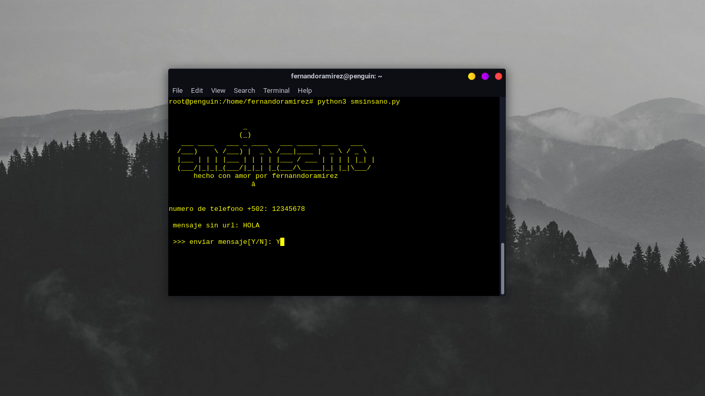

<h1>smsinsano</h1>
 

actualmente no funciona en termux 

 

para poder usar este script debes tener instalado python3 puedes instalarlo con:

 
<pre>apt install python3 </pre>

para poder usar este script debes ejecurar este comando

 
<pre>git clone https://github.com/fernandoC244/smsinsano</pre>
<pre>cd smsinsano</pre>
<pre> python3 smsinsano.py </pre>

<h2>probado en </h2>
<pre>Parrot os   Ubuntu  kalix Linux Chrome os</pre>
